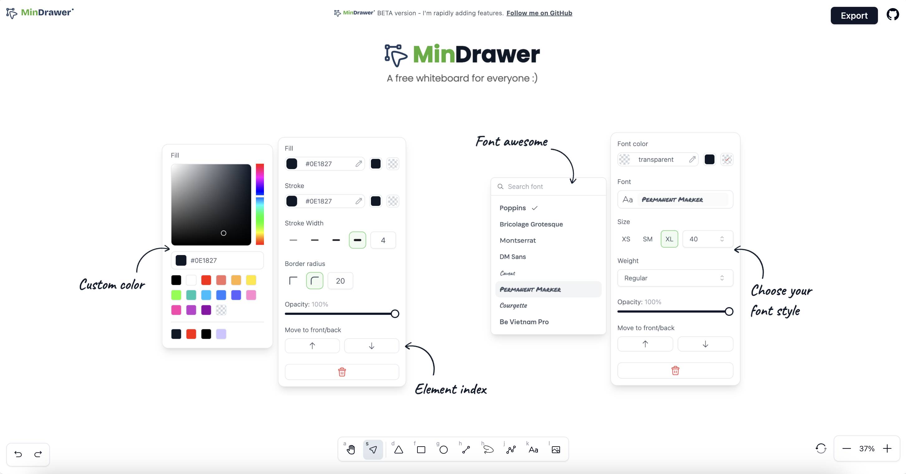
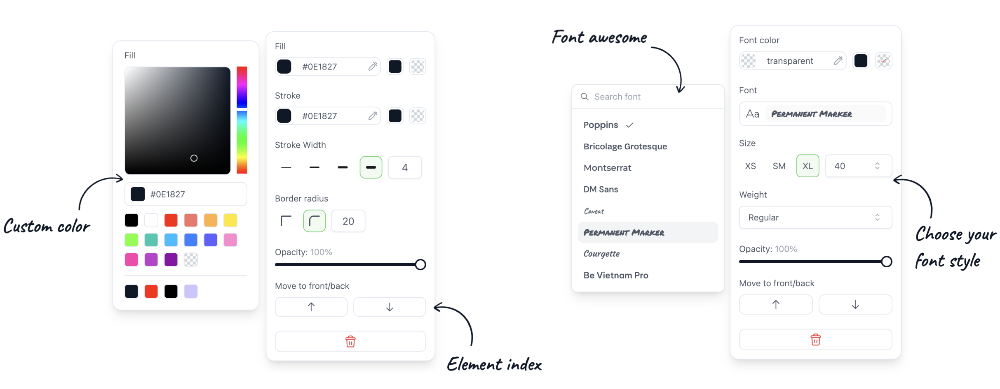
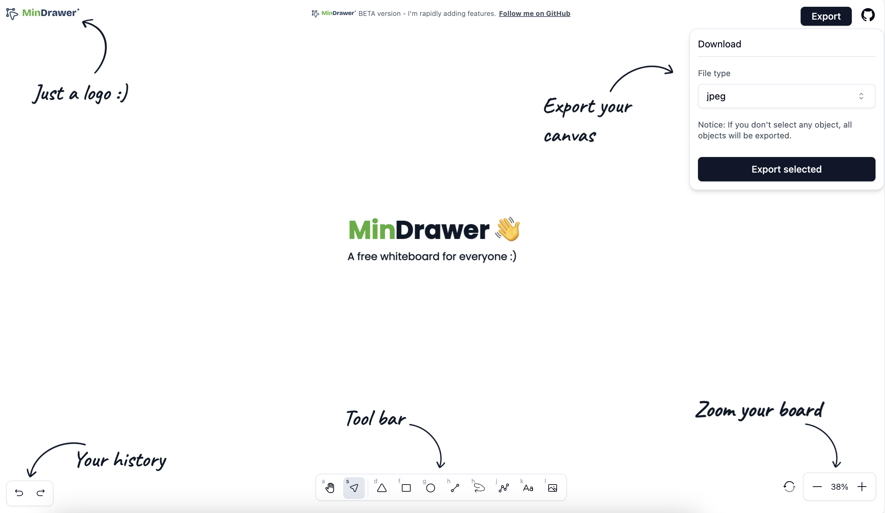

# Mindrawer - a free whiteboard for everyone

[](https://nuxt.com/)
[](https://tailwindcss.com/)
[](https://pinia.vuejs.org/)
[](https://vueuse.org/)
[](https://color-mode.nuxtjs.org/)
[](https://nuxt.awesome-starter.vercel.app/)
[](https://github.com/huynamboz/mindrawer)


Mindrawer is a free whiteboard for everyone. It's built with Nuxt 3, Tailwind CSS, Pinia, Vueuse, and more. It's a great starting point for your next project.


- 📖&nbsp; [Demo](https://mindrawer.pages.dev/)

> **NOTES**
>
> - This Project using "yarn" as package manager, you can change it to "npm" or "pnpm" if you want.

## Preview

<table align="center">
  <tr>
    <td align="center" width="100%" colspan="2">
      
    </td>
  </tr>
   <tr>
    <td align="center" width="100%" colspan="2">
      
    </td>
  </tr>
  <tr>
    <td align="center" width="100%" colspan="2">
      
    </td>
  </tr>
</table>
<p align="center">
  <br>
  <a href="https://mindrawer.pages.dev/" target="_blank">Live Demo</a>
  <br><br>
</p>

## Features

- [X] 📚 [Shadcn-vue](https://shadcn-vue.vercel.app/)
- [X] 💨 [Tailwind CSS v3](https://tailwindcss.com/)
- [X] 🔔 [Ofetch]()
- [X] 🛹 [State & Store Management (Pinia)](https://pinia.vuejs.org/)
- [X] 📦 [Vue Composition Collection (Vueuse)](https://vueuse.org/)
- [X] 🪝 Built-in Awesome Component & Layout

## Contributors ✨

Thanks go to these wonderful people 💼

<!-- ALL-CONTRIBUTORS-LIST:START - Do not remove or modify this section -->
<!-- prettier-ignore-start -->
<!-- markdownlint-disable -->
<table>
  <tbody>
    <tr>
      <td align="center" valign="top" width="14.28%"><a href="https://github.com/huynamboz"><br /><sub><b>huynamboz</b></sub></a><br /><a href="https://github.com/all-contributors/all-contributors/commits?author=huynamboz" title="Documentation">💻</a></td>
    </tr>
  </tbody>
</table>
## Getting Started

### Installation

- clone this repository
  ```bash
  git clone https://github.com/huynamboz/mindrawer
  ```
- install dependencies
  ```bash
  yarn install
  ```
- run development server
  ```bash
  yarn dev
  ```